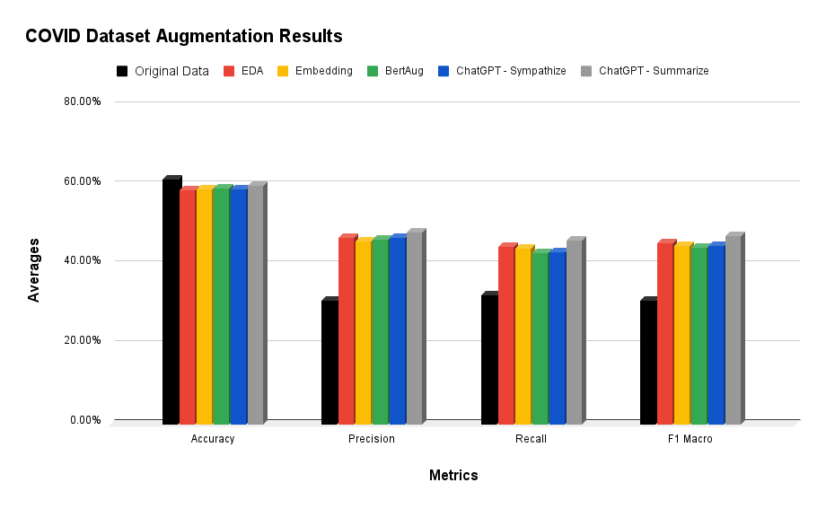
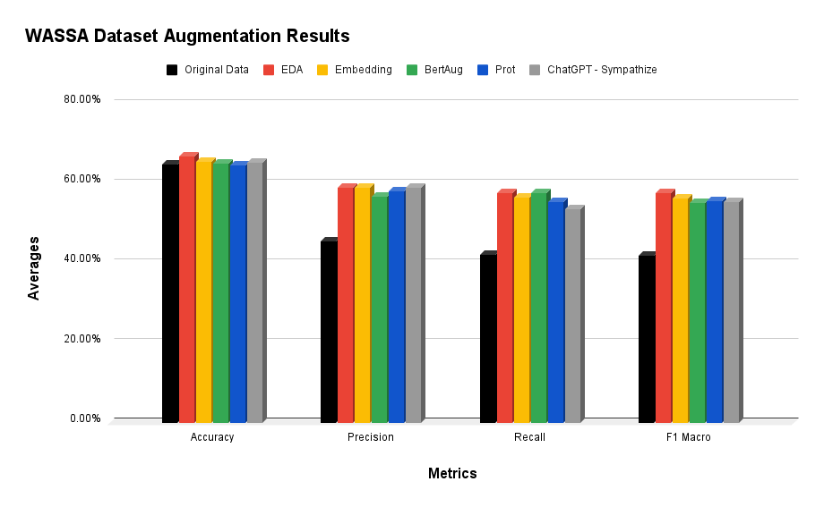
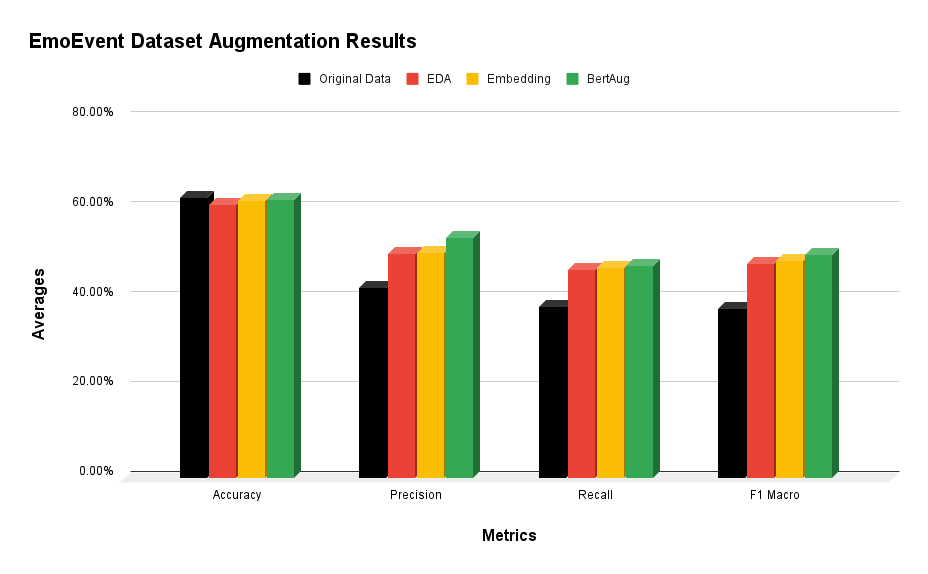

# AI and Deep Learning: Exploring the Impact of Data Augmentation on Text-based Emotion Recognition

## Research conducted with Dr. Anna Koufakou, Diego Grisales Ragy Costa de jesus, and Oscar Fox. 

"Data Augmentation for Emotion Detection in Small Imbalanced Text Data", to be presented at the 22nd IEEE International Conference on Machine Learning and Applications, 2023. Pre-print: https://arxiv.org/abs/2310.17015

###
The task of detecting emotions from text has become increasingly popular
in recent years, mostly due to significant recent advances in Natural
Language Processing (NLP). Emotion recognition or classification from text
is a challenging task, as emotions are hard to describe or pinpoint, and
different emotions such as joy and anxiety can co-occur, especially for
longer text records.
One of the issues with text understanding in general, but emotion
recognition in particular, is the small size of available data that has been
annotated with emotions by experts. Our literature survey shows that
researchers have tried to alleviate this issue by artificially generating text in
order to enlarge or augment the data. This can be achieved in various
different ways, for example replacing a word with a synonym or
paraphrasing the existing text using chatGPT, etc.
In this study, we continue our previous work in emotion detection with small
text datasets. Our goal is to investigate different data augmentation
techniques on our data and especially their impact on the model
performance given the task of emotion recognition. We utilize
state-of-the-art machine learning models to detect emotions based on
textual comments and perform extensive experiments to compare the
effects of the various augmentation approaches.

### Results:

#### Datasets:

1. COVID-19 Survey: collected via survey in UK in lockdown April 2020. 2,500 participants
wrote text responses and rated their emotions e.g. worry, anxiety, relaxation, etc.
https://github.com/ben-aaron188/covid19worry 
2. WASSA: part of the WASSA 2021 Shared Task. Contains essays written after reading
news articles related to harm to an individual, nature, etc.
https://competitions.codalab.org/competitions/28713
3. EmoEvent: dataset composed of tweets from the Twitter platform whcih exhibit different emotions in relation to various events.
https://github.com/fmplaza/EmoEvent

